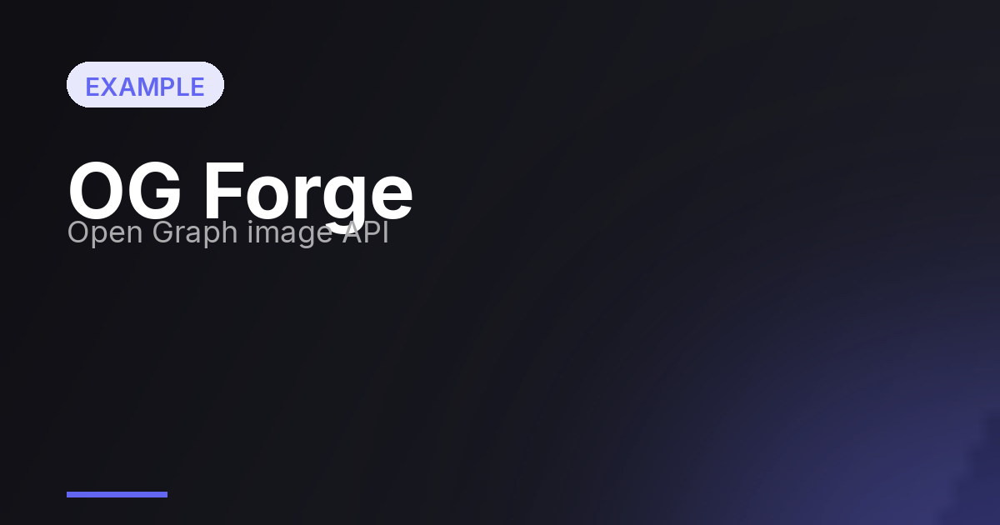
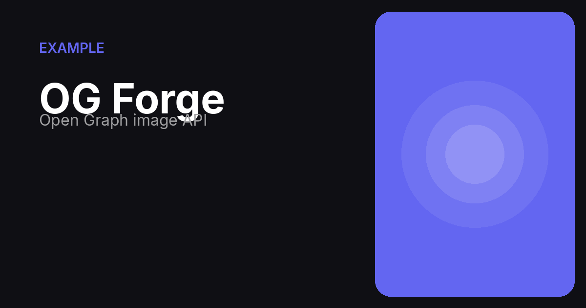
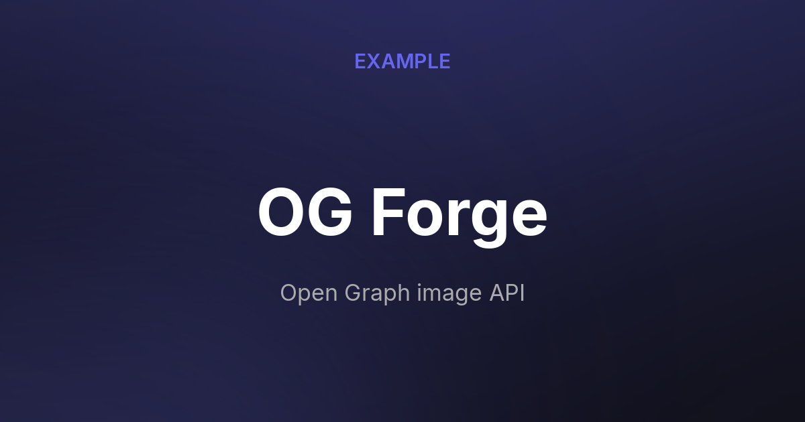
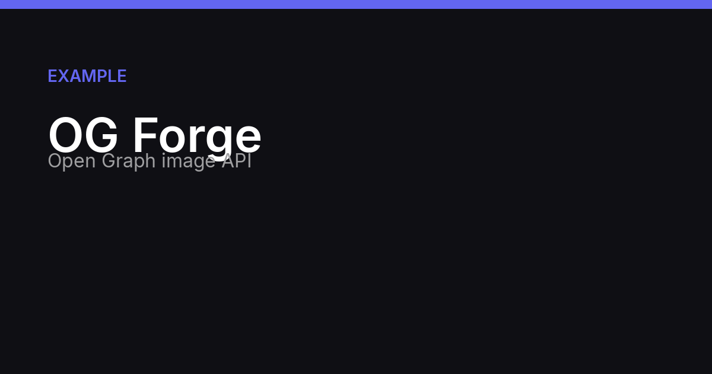
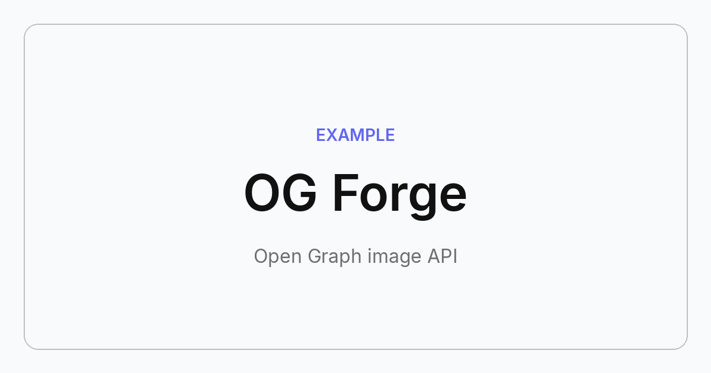

# ⚒️ OG Forge

**Open Graph image generation API.** One GET request in, a beautiful social card out.

```
GET /v1/generate?title=Ship%20Your%20Side%20Project&template=gradient
→ image/png (1200×630, ~40ms)
```



## Features

- **5 templates** — Gradient, Split, Spotlight, Banner, Minimal
- **~35ms average render** — pure Pillow pipeline, no headless browser, no external AI APIs
- **Auto-fitting typography** — titles shrink and wrap; no broken layouts
- **Full color control** — background, accent, text colors via hex
- **Any dimensions** — 200px to 2400px (default 1200×630 OG standard)
- **Freemium built-in** — per-IP rate limiting (10/min free), API-key tier hook
- **Self-contained** — single Docker image, ~60MB, runs on any free tier

## Quick start

```bash
pip install -r requirements.txt
uvicorn app.main:app --port 8000
# open http://localhost:8000 for the live playground
```

Or with Docker:

```bash
docker build -t og-forge .
docker run -p 8000:8000 og-forge
```

## API

| Param | Type | Default | Description |
|---|---|---|---|
| `title` | string | *required* | Card title (max 200 chars) |
| `subtitle` | string | — | Secondary text |
| `brand` | string | — | Small brand/eyebrow text |
| `template` | enum | `gradient` | `gradient` `split` `spotlight` `banner` `minimal` |
| `bg_color` | hex | template default | Background start color |
| `bg_color2` | hex | template default | Background end color (gradient) |
| `accent_color` | hex | `#6366f1` | Accent color |
| `text_color` | hex | auto contrast | Text color |
| `width` / `height` | px | 1200 / 630 | Output size |
| `theme` | enum | `auto` | `auto` `dark` `light` |

Use in HTML:

```html
<meta property="og:image"
  content="https://your-host/v1/generate?title=My%20Page&template=split&accent_color=%23e11d48">
```

Pro tier: send `X-API-Key` header to bypass rate limits.

## Templates

| Gradient | Split | Spotlight | Banner | Minimal |
|---|---|---|---|---|
|  |  |  |  |  |

## Architecture

```
app/
├── generator.py   # Rendering engine (Pillow): templates, text layout, gradients
└── main.py        # FastAPI endpoints + rate limiting
static/landing.html  # Live playground landing page
fonts/               # Inter (SIL OFL 1.1)
```

## License

MIT for code. Inter fonts © Rasmus Andersson, SIL OFL 1.1.

---

*Built autonomously by an AI agent (GLM-5.3). See [DEPLOY.md](DEPLOY.md) for monetization setup.*
